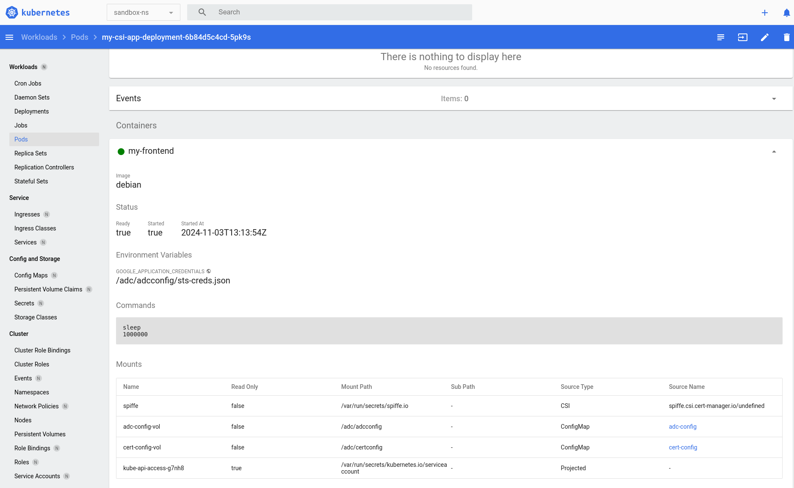
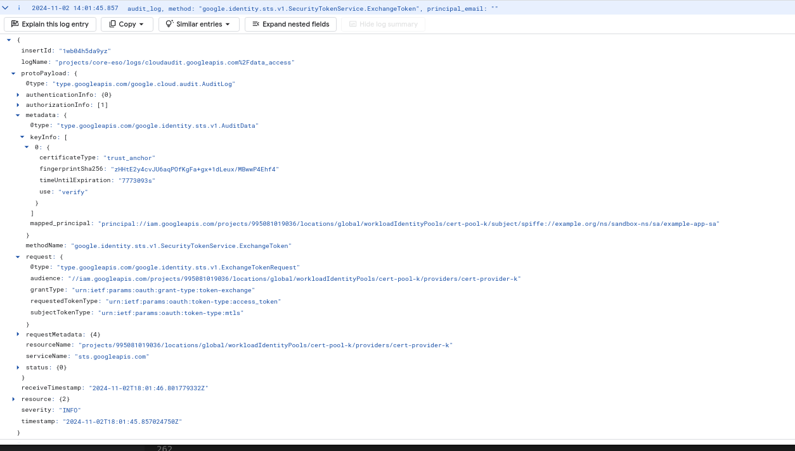
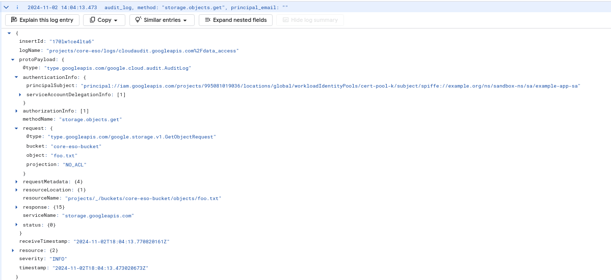

### GCP Workload Federation using Kubernetes SPIFFE mTLS

Simple demo of GCP workload federation using mTLS on kubernetes.

Specifically, this will use a basic [cert-manager](https://cert-manager.io/) CA to issue a [spiffe X509-SVID](https://spiffe.io/docs/latest/spiffe-about/spiffe-concepts/) to a given workload based on a trust domain, namespace and assigned kubernetes service account:

```bash
X509v3 Subject Alternative Name: critical
    URI:spiffe://example.org/ns/sandbox-ns/sa/example-app-sa
```

The workload will then use the certificates to authenticate to GCP using [Workload Identity Federation with X.509 certificates](https://cloud.google.com/iam/docs/workload-identity-federation-with-x509-certificates) as

```bash
"principal://iam.googleapis.com/projects/$PROJECT_NUMBER/locations/global/workloadIdentityPools/$POOL_ID/subject/spiffe://example.org/ns/sandbox-ns/sa/example-app-sa"
```

---

For this demo, you'll need

* [minikube](https://minikube.sigs.k8s.io/docs/)
* [helm](https://helm.sh/)
* [cert-manager cli](https://github.com/cert-manager/cmctl/releases)

---

Additional references:

* [Using Kubernetes Service Accounts for Google Workload Identity Federation](https://github.com/salrashid123/k8s_federation_with_gcp)
* [GCP Workload Identity Federation using x509 certificates](https://github.com/salrashid123/mtls-tokensource)
* [gRPC AdvancedTLS provider packages for Trusted Platform Module](https://github.com/salrashid123/grpc-cert-provider)
* [cert-manager CSI driver for Spiffe ](https://cert-manager.io/docs/usage/csi-driver-spiffe/installation/)
* [AWS SDK CredentialProvider for RolesAnywhere](https://github.com/salrashid123/aws_rolesanywhere_signer)

---

### Setup

First start `minikube`, i used kvm2 but you can use anything

#### Start Minikube

```bash
minikube start --driver=kvm2  --cpus=4 --kubernetes-version=v1.26.1

minikube dashboard
```

#### Install Spire

Install Spire server and agent into the cluster.  For this we'll just use the demo spire provides

```bash
git clone https://github.com/spiffe/spire-tutorials.git

cd spire-tutorials/k8s/quickstart/

kubectl apply -f spire-namespace.yaml

kubectl apply \
    -f server-account.yaml \
    -f spire-bundle-configmap.yaml \
    -f server-cluster-role.yaml

kubectl apply \
    -f server-configmap.yaml \
    -f server-statefulset.yaml \
    -f server-service.yaml

kubectl apply \
    -f agent-account.yaml \
    -f agent-cluster-role.yaml

kubectl apply \
    -f agent-configmap.yaml \
    -f agent-daemonset.yaml

kubectl exec -n spire spire-server-0 -- \
    /opt/spire/bin/spire-server entry create \
    -spiffeID spiffe://example.org/ns/spire/sa/spire-agent \
    -selector k8s_sat:cluster:demo-cluster \
    -selector k8s_sat:agent_ns:spire \
    -selector k8s_sat:agent_sa:spire-agent \
    -node    

kubectl exec -n spire spire-server-0 -- \
    /opt/spire/bin/spire-server entry create \
    -spiffeID spiffe://example.org/ns/default/sa/default \
    -parentID spiffe://example.org/ns/spire/sa/spire-agent \
    -selector k8s:ns:default \
    -selector k8s:sa:default
```

#### Install cert-manager CSI driver

Now install [cert-manager csi driver for spiffe](https://cert-manager.io/docs/usage/csi-driver-spiffe/)

```bash
helm repo add jetstack https://charts.jetstack.io 

helm install \
  cert-manager jetstack/cert-manager \
  --namespace cert-manager \
  --create-namespace \
  --version v1.16.1 \
  --set crds.enabled=true --set disableAutoApproval=true

## create a certIssuer.  Since this is a demo, the issuer CA is just 'selfsigned'.  
### In reality, you'd back it with KMS or some external approval chain to authorize workloads cert issuance
#### eg https://cert-manager.io/docs/configuration/issuers/
kubectl apply -f https://raw.githubusercontent.com/cert-manager/csi-driver-spiffe/ed646ccf28b1ecdf63f628bf16f1d350a9b850c1/deploy/example/clusterissuer.yaml

## download the binary for the cert-manager cli (cmctl). https://github.com/cert-manager/cmctl/releases
###  I use linux amd so for me its at
wget https://github.com/cert-manager/cmctl/releases/download/v2.1.1/cmctl_linux_amd64

./cmctl_linux_amd64 approve -n cert-manager $(kubectl get cr -n cert-manager -ojsonpath='{.items[0].metadata.name}')

helm upgrade cert-manager-csi-driver-spiffe jetstack/cert-manager-csi-driver-spiffe \
  --install \
  --namespace cert-manager \
  --wait \
  --set "app.logLevel=1" \
  --set "app.trustDomain=example.org" \
  --set "app.issuer.name=csi-driver-spiffe-ca" \
  --set "app.issuer.kind=ClusterIssuer" \
  --set "app.issuer.group=cert-manager.io"
```

If everything went well, print the root CA; we'll need this later to setup workload federation

```bash  
$ kubectl -n cert-manager get certificate
NAME                   READY   SECRET                 AGE
csi-driver-spiffe-ca   True    csi-driver-spiffe-ca   15m

$ kubectl -n cert-manager get secret csi-driver-spiffe-ca -o jsonpath='{.data.ca\.crt}' | base64 -d 
-----BEGIN CERTIFICATE-----
MIIDCjCCAfKgAwIBAgIQUIlM7cuL3/cJo9P7TdO3fTANBgkqhkiG9w0BAQsFADAf
MR0wGwYDVQQDExRjc2ktZHJpdmVyLXNwaWZmZS1jYTAeFw0yNDExMDIxNzEzMTla
Fw0yNTAxMzExNzEzMTlaMB8xHTAbBgNVBAMTFGNzaS1kcml2ZXItc3BpZmZlLWNh
MIIBIjANBgkqhkiG9w0BAQEFAAOCAQ8AMIIBCgKCAQEAxbv3+DMMx4ahdelexGr5
ffjLuoVqz7qVEZtkIZ06pmwoW9BgZhyVpCLnuDiRLw5kqelN/2TE+3Rz5Tgk4oZH
qAbv72MLQqjvdR2eC3em9kwkdb6TrThIHtagqu3keBjRWoAFfvmQJyib1ZgVN5G+
cngtVVv2pfi1t1nes/wH+F1LFxRZiuPoeH0Bj5cO9seUeG5jHFMiQkupJrA6wMG+
8lAnZqS1Q85BIKuWPoMUM7OOkp+r9bcStOWEMpcES8WnpJtbM4PDKjiSYYW0tIiZ
/zBr20k5yB0Ssqr0IqXbyFaZ6U/hha3p6l0sUgdrAJRg+9LZdgOw5snT0FcGwfgY
UwIDAQABo0IwQDAOBgNVHQ8BAf8EBAMCAqQwDwYDVR0TAQH/BAUwAwEB/zAdBgNV
HQ4EFgQUtsNZxiSBfWWDOolTlRAZyVHZdZAwDQYJKoZIhvcNAQELBQADggEBAJx9
iE1YCB4ktcutK13l2Nmjt/PrLOCpEDiKraJe/tD+gfFh4XP6JgpMOnxYMG/id8ta
7IKkC7OFStBx0TUisMJbn5F3rCu4klDn9COwfhUGdFxzVPtQ/MI6rE/picvgM7Td
FZJXcV+9xFgzFUj0vC1QFIihnilrsF9qWrGZi+YvIFcC4h2+OpbEtZShFQzoBPEB
mlSHGFRd/2uVSqXX0i/LQvMacIRByUndherwCQO2Nn4SIyh9VhnOgdlqC1q0w9Hb
YqIVALkuBBEw8TQlkWuFvilj0CmdwDZQqXadBq6OMoeFjB6VzB08Il25JHkdfA7Y
CxFjn12JfCgQxLEUc6Y=
-----END CERTIFICATE-----

## you should see the root ca cert-manager uses to issue spiffe cert
$ kubectl -n cert-manager get secret csi-driver-spiffe-ca -o jsonpath='{.data.ca\.crt}' | base64 -d  | openssl x509 --noout --text 
Certificate:
    Data:
        Version: 3 (0x2)
        Serial Number:
            50:89:4c:ed:cb:8b:df:f7:09:a3:d3:fb:4d:d3:b7:7d
        Signature Algorithm: sha256WithRSAEncryption
        Issuer: CN=csi-driver-spiffe-ca
        Validity
            Not Before: Nov  2 17:13:19 2024 GMT
            Not After : Jan 31 17:13:19 2025 GMT
        Subject: CN=csi-driver-spiffe-ca
        Subject Public Key Info:
            Public Key Algorithm: rsaEncryption
                Public-Key: (2048 bit)
                Modulus:
                    00:c5:bb:f7:f8:33:0c:c7:86:a1:75:e9:5e:c4:6a:
                    f9:7d:f8:cb:ba:85:6a:cf:ba:95:11:9b:64:21:9d:
                    3a:a6:6c:28:5b:d0:60:66:1c:95:a4:22:e7:b8:38:
                    91:2f:0e:64:a9:e9:4d:ff:64:c4:fb:74:73:e5:38:
                    24:e2:86:47:a8:06:ef:ef:63:0b:42:a8:ef:75:1d:
                    9e:0b:77:a6:f6:4c:24:75:be:93:ad:38:48:1e:d6:
                    a0:aa:ed:e4:78:18:d1:5a:80:05:7e:f9:90:27:28:
                    9b:d5:98:15:37:91:be:72:78:2d:55:5b:f6:a5:f8:
                    b5:b7:59:de:b3:fc:07:f8:5d:4b:17:14:59:8a:e3:
                    e8:78:7d:01:8f:97:0e:f6:c7:94:78:6e:63:1c:53:
                    22:42:4b:a9:26:b0:3a:c0:c1:be:f2:50:27:66:a4:
                    b5:43:ce:41:20:ab:96:3e:83:14:33:b3:8e:92:9f:
                    ab:f5:b7:12:b4:e5:84:32:97:04:4b:c5:a7:a4:9b:
                    5b:33:83:c3:2a:38:92:61:85:b4:b4:88:99:ff:30:
                    6b:db:49:39:c8:1d:12:b2:aa:f4:22:a5:db:c8:56:
                    99:e9:4f:e1:85:ad:e9:ea:5d:2c:52:07:6b:00:94:
                    60:fb:d2:d9:76:03:b0:e6:c9:d3:d0:57:06:c1:f8:
                    18:53
                Exponent: 65537 (0x10001)
        X509v3 extensions:
            X509v3 Key Usage: critical
                Digital Signature, Key Encipherment, Certificate Sign
            X509v3 Basic Constraints: critical
                CA:TRUE
            X509v3 Subject Key Identifier: 
                B6:C3:59:C6:24:81:7D:65:83:3A:89:53:95:10:19:C9:51:D9:75:90
    Signature Algorithm: sha256WithRSAEncryption
    Signature Value:
        9c:7d:88:4d:58:08:1e:24:b5:cb:ad:2b:5d:e5:d8:d9:a3:b7:
        f3:eb:2c:e0:a9:10:38:8a:ad:a2:5e:fe:d0:fe:81:f1:61:e1:
        73:fa:26:0a:4c:3a:7c:58:30:6f:e2:77:cb:5a:ec:82:a4:0b:
        b3:85:4a:d0:71:d1:35:22:b0:c2:5b:9f:91:77:ac:2b:b8:92:
        50:e7:f4:23:b0:7e:15:06:74:5c:73:54:fb:50:fc:c2:3a:ac:
        4f:e9:89:cb:e0:33:b4:dd:15:92:57:71:5f:bd:c4:58:33:15:
        48:f4:bc:2d:50:14:88:a1:9e:29:6b:b0:5f:6a:5a:b1:99:8b:
        e6:2f:20:57:02:e2:1d:be:3a:96:c4:b5:94:a1:15:0c:e8:04:
        f1:01:9a:54:87:18:54:5d:ff:6b:95:4a:a5:d7:d2:2f:cb:42:
        f3:1a:70:84:41:c9:49:dd:85:ea:f0:09:03:b6:36:7e:12:23:
        28:7d:56:19:ce:81:d9:6a:0b:5a:b4:c3:d1:db:62:a2:15:00:
        b9:2e:04:11:30:f1:34:25:91:6b:85:be:29:63:d0:29:9d:c0:
        36:50:a9:76:9d:06:ae:8e:32:87:85:8c:1e:95:cc:1d:3c:22:
        5d:b9:24:79:1d:7c:0e:d8:0b:11:63:9f:5d:89:7c:28:10:c4:
        b1:14:73:a6
```


#### Configure Workload Federation

We're ready to configure workload federation to trust this CA for authentication.

```bash
## First step is to allow "MTLS" as an workload federation provider in your org.  Your policy should include "MTLS" as shown below
export ORGANIZATION_ID=123456789
$ gcloud resource-manager org-policies describe constraints/iam.workloadIdentityPoolProviders  --organization=$ORGANIZATION_ID
constraint: constraints/iam.workloadIdentityPoolProviders
listPolicy:
  allowedValues:
  - MTLS

### Configure providers (you will need pick any unique pool/provider name)
export PROJECT_ID=`gcloud config get-value core/project`
export PROJECT_NUMBER=`gcloud projects describe $PROJECT_ID --format='value(projectNumber)'`
export POOL_ID="cert-pool-k"
export PROVIDER_ID="cert-provider-k"

### extract just the CA certificate
#### since i'm using a basic cert-manager CA you use rotates the signers, you will 
#### need to update the trustAnchors in the workload pool
kubectl -n cert-manager get secret csi-driver-spiffe-ca -o jsonpath='{.data.ca\.crt}' | base64 -d  > root-ca.crt    

export ROOT_CERT=$(cat root-ca.crt | sed 's/^[ ]*//g' | sed -z '$ s/\n$//' | tr '\n' $ | sed 's/\$/\\n/g')

### create the trustAnchors for federation
cat << EOF > trust_store.yaml
trustStore:
  trustAnchors:
  - pemCertificate: "${ROOT_CERT}"
EOF

### create the pool
gcloud iam workload-identity-pools create $POOL_ID \
    --location="global" \
    --description="Certificate Pool" \
    --display-name="Certificate Pool"

## create the provider.  Note that the attribute condition below i'm going the extra mile to say "just trust namespace=sandbox-ns 
### within this provider.  I'm also mapping google.subject to the SPIFFE SAN value within the client cert that'll get issued
gcloud iam workload-identity-pools providers create-x509 $PROVIDER_ID \
    --location=global \
    --workload-identity-pool=$POOL_ID \
    --trust-store-config-path="trust_store.yaml" \
    --attribute-mapping="google.subject=assertion.san.uri"  \
    --attribute-condition="assertion.san.uri.startsWith('spiffe://example.org/ns/sandbox-ns')"  \
    --billing-project="$PROJECT_ID"

#### Now crate an IAM binding with this.
####  notice the subject here.  This policy will restrict access to a specific workload 
####  that has that specific SAN value in the cert (spiffe://example.org/ns/sandbox-ns/sa/example-app-sa)
####  note, i'm lazy here and gave admin rights to all buckets in the project...you should use minimal privileges next time
gcloud projects add-iam-policy-binding $PROJECT_ID  \
 --member "principal://iam.googleapis.com/projects/$PROJECT_NUMBER/locations/global/workloadIdentityPools/$POOL_ID/subject/spiffe://example.org/ns/sandbox-ns/sa/example-app-sa" \
   --role=roles/storage.admin

### create a bucket and upload a file. 
gcloud storage buckets create gs://$PROJECT_ID-bucket
echo -n "bar" > /tmp/foo.txt
gcloud storage cp /tmp/foo.txt gs://$PROJECT_ID-bucket
```

#### Deploy Application

Deploy the application, i'm using `envsubst`.  You can just edit the file if you want to 

```bash
envsubst < "my-deployment.yaml.tmpl" > "my-deployment.yaml"
kubectl apply -f my-deployment.yaml
```

Once deployed, you can navigate to the minikube console by running `minikube dashboard`.

If the deployment worked, you'll see the csi driver mounts



The specific deployment specification configures two files as mounts

`/adc/adcconfig/sts-creds.json` is mounted and is basically what `GOOGLE_APPLICATION_CREDENTIALS` environment variable will point to for any application 

```json
    {
      "universe_domain": "googleapis.com",
      "type": "external_account",
      "audience": "//iam.googleapis.com/projects/$PROJECT_NUMBER/locations/global/workloadIdentityPools/$POOL_ID/providers/$PROVIDER_ID",
      "subject_token_type": "urn:ietf:params:oauth:token-type:mtls",
      "token_url": "https://sts.mtls.googleapis.com/v1/token",
      "credential_source": {
        "certificate": {
          "certificate_config_location": "/adc/certconfig/cert-config.json"
        }
      },
      "token_info_url": "https://sts.mtls.googleapis.com/v1/introspect"
    }
```

Notice the file itself points to where the certificate config is

`/adc/certconfig/cert_config.json` a file which points to the actual certs and keys given by spiffe

```json
    {
      "cert_configs": {
        "workload": {
          "cert_path": "/var/run/secrets/spiffe.io/tls.crt",
          "key_path": "/var/run/secrets/spiffe.io/tls.key"
        }
      }
    }
```


#### Test Workload Federation

If everything is  deployed, print out the cert to see the details:


```bash
kubectl exec -n sandbox-ns \
  $(kubectl get pod -n sandbox-ns -l app=my-csi-app -o jsonpath='{.items[0].metadata.name}') \
  -- \
  cat /var/run/secrets/spiffe.io/tls.crt | \
  openssl x509 --noout --text 

### you should see something like this
Certificate:
    Data:
        Version: 3 (0x2)
        Serial Number:
            6b:82:f1:fc:3d:4e:7f:cd:e2:94:ea:3b:86:91:8f:07
        Signature Algorithm: sha256WithRSAEncryption
        Issuer: CN=csi-driver-spiffe-ca
        Validity
            Not Before: Nov  2 20:27:21 2024 GMT
            Not After : Nov  2 21:27:21 2024 GMT
        Subject: 
        Subject Public Key Info:
            Public Key Algorithm: id-ecPublicKey
                Public-Key: (256 bit)
                pub:
                    04:57:57:8a:a8:7a:6a:8f:bb:d8:57:58:53:4d:29:
                    62:5b:7c:f6:b3:76:93:47:1b:4f:9c:95:0e:44:8b:
                    03:70:5e:f0:99:e1:ee:f3:ab:0b:16:49:fc:50:3d:
                    69:34:de:da:2a:65:7e:f9:bf:1b:58:b7:66:ee:32:
                    9c:f9:19:a1:63
                ASN1 OID: prime256v1
                NIST CURVE: P-256
        X509v3 extensions:
            X509v3 Key Usage: critical
                Digital Signature, Key Encipherment
            X509v3 Extended Key Usage: 
                TLS Web Server Authentication, TLS Web Client Authentication
            X509v3 Basic Constraints: critical
                CA:FALSE
            X509v3 Authority Key Identifier: 
                B6:C3:59:C6:24:81:7D:65:83:3A:89:53:95:10:19:C9:51:D9:75:90
            X509v3 Subject Alternative Name: critical
                URI:spiffe://example.org/ns/sandbox-ns/sa/example-app-sa
    Signature Algorithm: sha256WithRSAEncryption
    Signature Value:
        6f:11:30:00:05:09:80:f3:48:98:f8:81:31:27:61:2c:1a:ce:
        d2:1b:8a:e3:e0:6c:03:70:37:a9:41:70:3f:01:fa:1d:89:11:
        73:b5:77:64:d7:52:fd:2a:df:7c:21:77:c0:f6:21:5f:59:9f:
        07:e6:01:af:d2:84:21:c0:aa:be:44:5f:2d:ba:88:fa:44:b8:
        4b:84:1e:eb:54:9d:dc:38:b8:8b:6c:84:1e:86:f0:9a:77:8b:
        bc:dd:ac:8a:9e:20:6d:a7:3d:3c:58:87:13:dd:ca:41:05:7b:
        59:be:2f:5b:aa:fb:59:02:e0:bf:68:84:3c:dc:64:36:9a:58:
        fb:ac:e8:05:e0:0e:cd:be:4a:a8:54:fc:ad:13:da:99:42:32:
        bb:54:63:fe:c7:66:5b:f2:65:d4:e0:5b:de:b1:a9:54:b4:dd:
        0a:30:8b:5a:60:cc:92:c5:e1:ad:91:fa:02:c9:73:5d:a8:34:
        e7:26:e0:53:d3:c9:1d:3d:4f:76:8b:09:69:b9:bb:91:21:b0:
        88:f1:8a:e8:41:77:43:0c:52:81:86:01:69:93:64:d7:72:bf:
        28:95:70:44:ca:81:4f:27:4e:da:74:77:c3:7d:d5:f4:61:db:
        9b:4e:a5:5f:26:71:76:7b:06:61:e6:27:a8:c2:06:fc:bc:2d:
        41:0c:e9:c3
```

notice  the SAN value:

```bash
            X509v3 Subject Alternative Name: critical
                URI:spiffe://example.org/ns/sandbox-ns/sa/example-app-sa
```

Thats what we'll use to test using curl

For now, exec to the container

```bash
$ kubectl exec -ti -n sandbox-ns   $(kubectl get pod -n sandbox-ns -l app=my-csi-app -o jsonpath='{.items[0].metadata.name}')   --  /bin/bash

## export PROJECT_NUMBER, POOL_ID, PROVIDER_ID
curl --key /var/run/secrets/spiffe.io/tls.key \
--cert /var/run/secrets/spiffe.io/tls.crt \
--request POST 'https://sts.mtls.googleapis.com/v1/token' \
--header "Content-Type: application/json" \
--data-raw '{
    "subject_token_type": "urn:ietf:params:oauth:token-type:mtls",
    "grant_type": "urn:ietf:params:oauth:grant-type:token-exchange",
    "audience": "//iam.googleapis.com/projects/'$PROJECT_NUMBER'/locations/global/workloadIdentityPools/'$POOL_ID'/providers/'$PROVIDER_ID'",
    "requested_token_type": "urn:ietf:params:oauth:token-type:access_token",
    "scope": "https://www.googleapis.com/auth/cloud-platform",
}'

### you should see an access_token
{
  "access_token": "ya29.d.c0ASRK0Gb...",
  "issued_token_type": "urn:ietf:params:oauth:token-type:access_token",
  "token_type": "Bearer",
  "expires_in": 3599
}

### use the access_token to read the gcs object

export BUCKET=$PROJECT_ID-bucket
export TOKEN="ya29.d.c0ASRK0Gb2CjRLUpsWqK52..."

curl -s -H "Authorization: Bearer $TOKEN"   "https://storage.googleapis.com/storage/v1/b/$BUCKET/o/foo.txt" 
```

To use Application Default Credentials (which you would do anyway), install python

```bash
apt-get update
apt-get install virtualenv vim python3-pip -q

virtualenv env
source env/bin/activate
pip3 install google-cloud-storage 
```

create `main.py` and remember to set values for your project and bucket

```python
from google.cloud import storage
import google.auth

storage_client = storage.Client('PROJECT_ID')

bucket = storage_client.bucket('BUCKET')
blob = bucket.blob('foo.txt')
out = blob.download_as_string()
print(out.decode('utf-8'))
```

Make sure the env var was set (it should've been set by the deployment )

```bash
echo $GOOGLE_APPLICATION_CREDENTIALS
## this should read /adc/adcconfig/sts-creds.json
```

Now run the app

```bash
python3 main.py
```

out pops `bar`

#### Audit Logging

If you enabled audit logging for GCS and the STS service, you'd first see the mTLS STS exchange



As a side note, the audit logs for sts prints the CA's fingerprint.  In our case, its `zHHtE2y4cvJU6aqPOfKgFa+gx+1dLeux/MBwwP4Ehf4`

which you can derive (in my case with the above CA its),

```bash
$ export fingerprint_hex=`kubectl -n cert-manager get secret csi-driver-spiffe-ca -o jsonpath='{.data.ca\.crt}' | base64 -d | openssl x509  -outform der   | openssl dgst -sha256 | cut -d" " -f2`

$ echo $fingerprint_hex | xxd -r -p - | openssl enc -a | tr -d '=' | tr '/+' '_-'
zHHtE2y4cvJU6aqPOfKgFa-gx-1dLeux_MBwwP4Ehf4
```

If you also enabled gcs audit logs you should see the principal spiffe workload access the resource:


